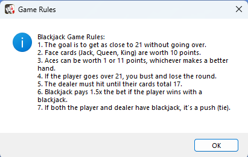
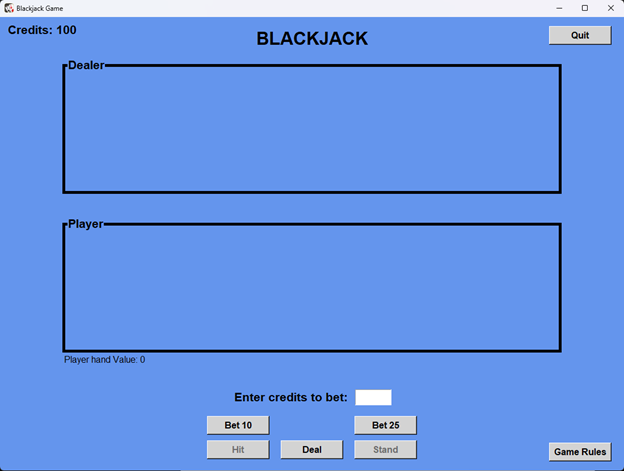
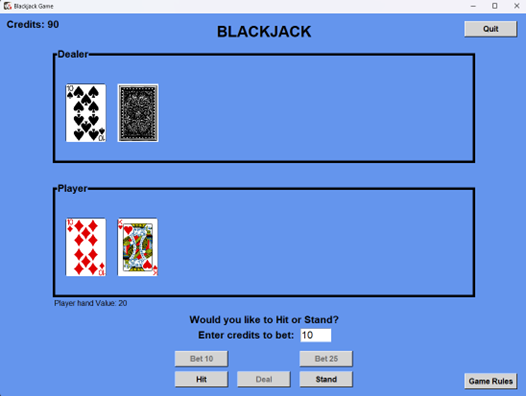
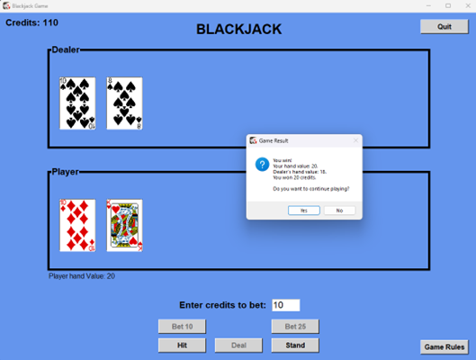

**Introduction**

This document provides an overview of the Blackjack game implementation
using Python\'s Tkinter library. The game simulates a simple Blackjack
game using standard rules mentioned later in this document.

**Overview of game:**

Blackjack is a popular card game where the player goal is to get as
close to 21 points as possible without exceeding it. Face cards (Jack,
Queen, King) are worth 10 points, and Aces can be worth 1 or 11 points
depending on whichever makes better hand. Players compete against the
dealer to see who can get the higher score without busting.

**Overview of rules:**

Rules have been integrated to the game. Rules will popup as soon as user
run the game program and can be accessed anytime during the game using
**Game rules** button integrated in the main window of the game.

**Main window:**

The game can be ran from main.py which has integration of 2 classes
**GameBoard** and **Cards**.

Shows the game title, Player credits (100 credits given initially),
dealer and player section for cards, Player hand value, fast bet buttons
(10 and 25 credits), quit button, hit button, stand button, deal button
and a textbox to enter deal credits manually. Only 10, 15, 20, 25
credits are allowed per round to bet.

**How to play the game:**

1.  **Starting the Game**: Launch the game by running main.py. The game
    window will open, displaying the Blackjack title, your current
    credits, and sections for dealer and player cards.

2.  **Placing a Bet**:

- Enter the amount you want to bet in the input field labeled \"Enter
  credits to bet.

- Alternatively, use the quick bet buttons (\"Bet 10\" and \"Bet 25\")
  to quickly set a bet amount.

- Click the \"Deal\" button to place your bet and start the game.

3.  **Dealing Cards**:

- After placing a bet, two cards will be dealt to both the player and
  the dealer.

- One of the dealer\'s cards will be faced down.

4.  **Player\'s Turn**:

- You can choose to \"Hit\" (draw another card) or \"Stand\" (keep your
  current hand).

- The goal is to get as close to 21 points without going over.

- If your hand value exceeds 21, you bust and lose the round.

5.  **Dealer\'s Turn**:

- Once you stand, the dealer will reveal their face-down card and draw
  additional cards until their hand value reaches at least 17.

- The dealer must follow strict rules for drawing cards and cannot make
  decisions like the player.

6.  **Determining the Winner**:

- If your hand value is closer to 21 than the dealer\'s without
  exceeding 21, you win the round and earn credits based on your bet.

- If the dealer\'s hand value is closer to 21, you lose the round and
  lose your bet.

- If both hands have the same value, it's a push (tie), and your bet is
  returned.

7.  **Continuing the Game**:

    - After the result is displayed, you can choose to continue playing
      by placing a new bet or quit the game.

8.  **Viewing Game Rules**:

    - Click the \"Game Rules\" button to view the rules of Blackjack at
      any time during the game.

**Main code components:**

**GameBoard Class**

The GameBoard class is responsible for creating and managing the main
game window, handling user interactions, and updating the game state.

- **Initialization**: Sets up the main window, background color, title,
  and initializes player credits.

- **createSections()**: Creates labeled sections for dealer and player
  cards.

- **addCreditsInput()**: Adds an input field for the player to enter bet
  credits.

- **addButtons()**: Adds buttons for placing bets, hitting, standing,
  quitting, and viewing game rules.

- **placeBet(amount)**: Sets the bet amount and calls the deal()
  function.

- **deal()**: Handles the initial deal of the game, including dealing
  cards to the player and dealer, checking for blackjack, and updating
  the game state.

- **checkBlackjack(hand)**: Checks if a hand is a blackjack.

- **revealDealerCards()**: Reveals all dealer cards.

- **showDealerCards(initial)**: Displays dealer\'s cards, with one face
  down if initial is True.

- **showResult(message, amount)**: Displays the game result and updates
  credits.

- **saveGameResult(message, amount)**: Saves the game result to a file.

- **updatePlayerHandValue()**: Updates the player\'s hand value display.

- **calculateHandValue(hand)**: Calculates the value of a hand.

- **validateBet(bet)**: Validates the bet amount.

- **hit()**: Handles the hit action, drawing a card for the player.

- **stand()**: Handles the stand action, triggering the dealer\'s play.

- **showPlayerCards()**: Displays player\'s cards.

- **dealerPlay()**: Handles the dealer\'s play, drawing cards until
  reaching at least 17.

- **enableButtons()**: Enables hit and stand buttons.

- **disableButtons()**: Disables hit and stand buttons.

- **disableFastBetButtons()**: Disables quick bet buttons.

- **enableFastBetButtons()**: Enables quick bet buttons.

- **resetBoard()**: Resets the game board for a new game.

- **quitGame()**: Quits the game.

- **showGameRules(initial)**: Displays game rules in a message box.

**Cards Class**

The Cards class handles the card deck, including loading card images,
shuffling the deck, dealing cards, and returning used cards.

- **Initialization**: Sets up the card folder, initializes lists for
  cards and used cards, loads card images, and builds the deck.

- **loadCardImages()**: Loads card images from the specified folder.

- **buildDeck()**: Builds the deck of cards by combining suits and
  ranks.

- **shuffleDeck()**: Shuffles the deck of cards.

- **dealCard()**: Deals a card from the deck, reshuffling used cards if
  the deck is empty.

- **returnCards(cards)**: Returns a list of cards to the used cards
  pile.

**Conclusion:**

This documentation provides a brief overview of the Blackjack game\'s
structure, main code components, and functionality. The GameBoard and
Cards classes work together to create a functional and interactive
Blackjack game, allowing players to play a classic card game on their
computer.

**References:**

Source for cards images:
<https://code.google.com/archive/p/vector-playing-cards/downloads>
